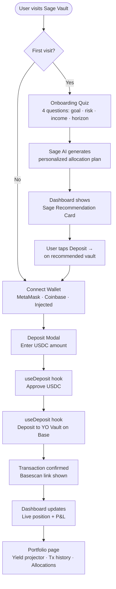
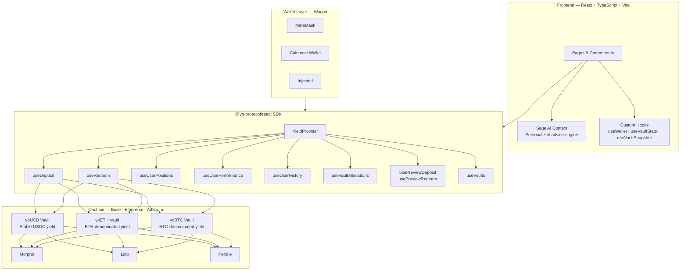
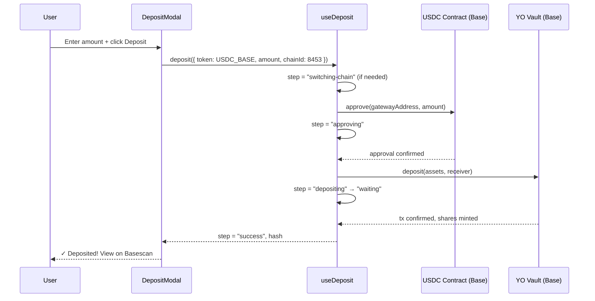

# Sage Vault — The Smartest DeFi Savings Account

> *"The smartest way to save, grow, and protect your money — powered by YO's risk-adjusted yields and guided by an intelligent AI co-pilot that understands you."*

[](https://yo.xyz)
[](https://base.org)
[](https://ethereum.org)
[](https://arbitrum.io)

---

## What is Sage Vault?

Sage Vault is a consumer-grade DeFi savings application built on [YO Protocol](https://yo.xyz). It combines YO's battle-tested, risk-adjusted yield infrastructure with an intelligent AI co-pilot — **Sage** — that builds a personalized savings strategy for each user and executes it onchain with a single tap.

It targets everyday savers who want inflation-beating returns without DeFi complexity — especially users in high-inflation regions (emerging markets, etc.) where stable, USD-denominated yield matters most.

---

## User Flow



---

## Architecture



---

## YO SDK Integration

This project uses `@yo-protocol/react` and `@yo-protocol/core` throughout. Below is every hook used and where:

| Hook | Used In | Purpose |
|---|---|---|
| `YieldProvider` | `main.tsx` | Wraps entire app, provides SDK context |
| `useDeposit` | `DepositModal.tsx` | Full approve → deposit → confirm flow |
| `useRedeem` | `RedeemModal.tsx` | Redeem shares, handles instant + queued |
| `usePreviewDeposit` | `DepositModal.tsx` | Live share preview before signing |
| `usePreviewRedeem` | `RedeemModal.tsx` | Live asset preview before signing |
| `useVaults` | `Vaults.tsx`, `yoExtras.ts` | Fetch all vault configs + stats |
| `useUserPositions` | `Dashboard.tsx` | User's positions across all chains |
| `useUserPerformance` | `Portfolio.tsx` | Realized + unrealized P&L per vault |
| `useUserHistory` | `Portfolio.tsx` | Full transaction history with Basescan links |
| `useUserBalances` | `Dashboard.tsx` | Total portfolio USD value |
| `useVaultAllocations` | `AllocationPanel.tsx` | Live protocol breakdown (Morpho %, Lido %, Pendle %) |
| `useYoClient` | `yoExtras.ts` | Direct client access for snapshot queries |

### Deposit Flow (step-by-step)



---

## Features

### 🤖 Sage AI Co-Pilot
- Conversational savings advisor grounded in live YO vault data
- Auto-extracts risk profile, income, and goals from natural language
- Personalized allocation recommendations (conservative / balanced / aggressive)
- Yield projections, inflation protection advice, safety explanations
- Quick-prompt chips for common questions

### 🎯 Smart Onboarding
- 4-step quiz: savings goal → risk tolerance → monthly savings → time horizon
- Generates a personalized Sage recommendation on completion
- Recommendation card on dashboard with live APY per vault and one-tap deposit buttons

### 🏦 Live YO Vault Integration
- Real deposit and redeem flows on Base (low gas, fast confirmations)
- Live APY, TVL, and share price from YO API
- Instant vs. queued redemption detection with request ID display
- Support for yoUSD, yoETH, yoBTC

### 📊 Portfolio & Analytics
- Real-time portfolio value via `useUserBalances`
- Per-vault P&L (realized + unrealized) via `useUserPerformance`
- Full transaction history with Basescan links
- Interactive yield projector (principal, monthly deposit, APY, time horizon)

### 🔍 Transparency Dashboard
- Protocol allocation breakdown per vault (Morpho, Lido, Pendle percentages)
- Animated allocation bars updated from live `useVaultAllocations` data
- Every transaction verifiable onchain

---

## Tech Stack

| Layer | Technology |
|---|---|
| Framework | React 18 + TypeScript + Vite |
| Styling | Tailwind CSS v4 + Framer Motion |
| Web3 | Wagmi v3 + Viem v2 |
| Data | TanStack Query v5 |
| YO SDK | `@yo-protocol/react` v1.0.6 + `@yo-protocol/core` v1.0.9 |
| Charts | Recharts v3 |
| Notifications | react-hot-toast |
| Analytics | Vercel Analytics |
| Deploy | Vercel |

---

## Getting Started

### Prerequisites
- Node.js 18+
- pnpm
- MetaMask or any EVM wallet with Base network configured

### Installation

```bash
git clone <repo-url>
cd YO
pnpm install
pnpm dev
```

Open [http://localhost:5173](http://localhost:5173)

### Build for Production

```bash
pnpm build
pnpm preview
```

### Deploy to Vercel

```bash
vercel --prod
```

---

## Supported Networks

| Network | Chain ID | Status |
|---|---|---|
| Base | 8453 | ✅ Primary (recommended — low gas) |
| Ethereum | 1 | ✅ Supported |
| Arbitrum | 42161 | ✅ Supported |

> Deposits default to Base for the best user experience (fast confirmations, low fees).

---

## Project Structure

```
src/
├── components/
│   ├── Navigation.tsx        # Responsive nav with mobile hamburger
│   ├── Landing.tsx           # Hero + live TVL/APY stats
│   ├── Dashboard.tsx         # Portfolio overview + Sage recommendation
│   ├── Vaults.tsx            # All YO vaults with allocation guide
│   ├── SagePage.tsx          # AI co-pilot chat interface
│   ├── Portfolio.tsx         # Analytics, projector, tx history
│   ├── DepositModal.tsx      # Full deposit flow (useDeposit)
│   ├── RedeemModal.tsx       # Full redeem flow (useRedeem)
│   ├── VaultCard.tsx         # Individual vault card with live data
│   ├── SageChat.tsx          # Conversational AI chat component
│   ├── SageRecommendation.tsx # Personalized allocation card
│   ├── AllocationPanel.tsx   # Live protocol breakdown
│   ├── Onboarding.tsx        # 4-step personalization quiz
│   └── YieldProjector.tsx    # Interactive yield simulation chart
├── context/
│   └── SageContext.tsx       # AI co-pilot state + response engine
├── hooks/
│   ├── useWallet.ts          # Wallet connection helpers
│   └── yoExtras.ts           # Polyfilled YO hooks (useVaultStats etc.)
├── utils/
│   └── format.ts             # USD/APY/bigint formatters + yield projector
└── wagmi.config.ts           # Wagmi chain + connector config
```

---

## Security & Trust

- **Non-custodial** — users retain full control of their funds at all times
- **No private keys** — wallet connection only, no seed phrases stored
- **Onchain verification** — every deposit and redeem links to a block explorer
- **Audited protocols** — YO deploys only to battle-tested protocols (Lido, Morpho, Pendle)
- **Transparent allocations** — live breakdown of where funds are deployed, visible in the dashboard
- **Slippage protection** — 0.5% default slippage on all deposits via YO SDK

---

## License

MIT

---

*Built for the YO Protocol Hackathon — "Build the Smartest DeFi Savings Account with YO"*
